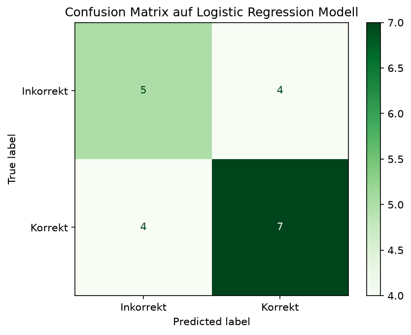

# FormCheck-AI

A machine learning system that analyzes push-up form and 
classifies it as correct or incorrect using pose estimation (MediaPipe).

## Motivation

In order to be able to work on one of my biggest interests at the moment, AI, I have
to start learning about how machine learning works. That's why I wanted to take my first
step into ML and combine it with one of my other passions in life: exercising.
So I brainstormed and came up with the idea to analyze the form of a push-up movement.

## What it does
1. Extract 33 body landmarks per frame using MediaPipe
2. Compute joint angles (elbow, spine, hip) from coordinates
3. Aggregate angles across frames (mean, min, max, std)
4. Classify as correct/incorrect using Logistic Regression

## Results

The accuracy on this was okay but far from great. I assume that it has to do
with the small amount of data that the model has to learn from. I tested 3 different
models: 
1. Random Forest
2. Logistic Regression
3. SVM

Logistic Regression performed best at 71%. Given only 100 training videos,
this is expected because the model picks up general patterns but doesn't have
enough data to generalize reliably.

## Limitations & Next Steps

- Data size: Only 100 videos (50 correct, 50 incorrect). More data would
  directly improve accuracy.
- 2D only: MediaPipe returns x/y coordinates without depth. Camera angle
  affects landmark positions, which makes angle calculation less reliable for
  non-frontal recordings.
- Next: Collect a larger dataset, experiment with deep learning (LSTM) to
  use the full temporal sequence instead of aggregated features.

## Tech Stack
- Python
- NumPy
- pandas
- scikit-learn
- Matplotlib
- Jupyter
- MediaPipe

## Project Structure
- `data/` — raw datasets (not tracked)
- `notebooks/` — exploration and analysis
- `src/` — reusable source code
- `figures/` — visualization of confusion matrix

## Status
✅ Complete